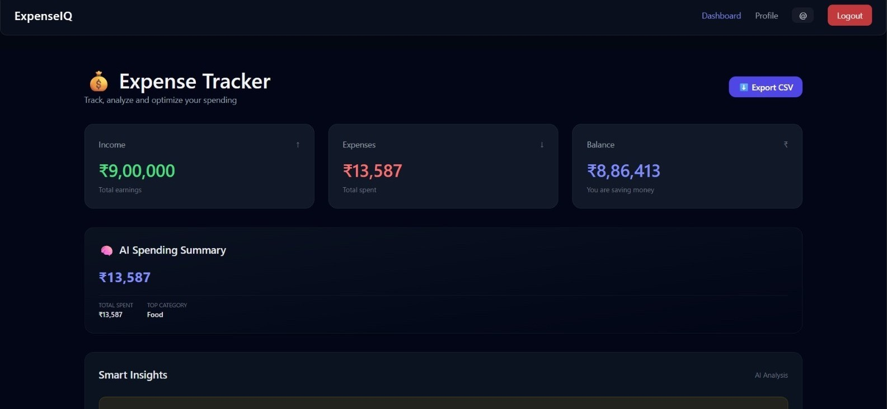
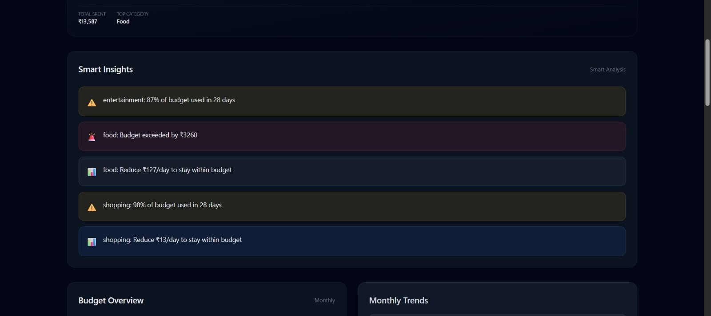
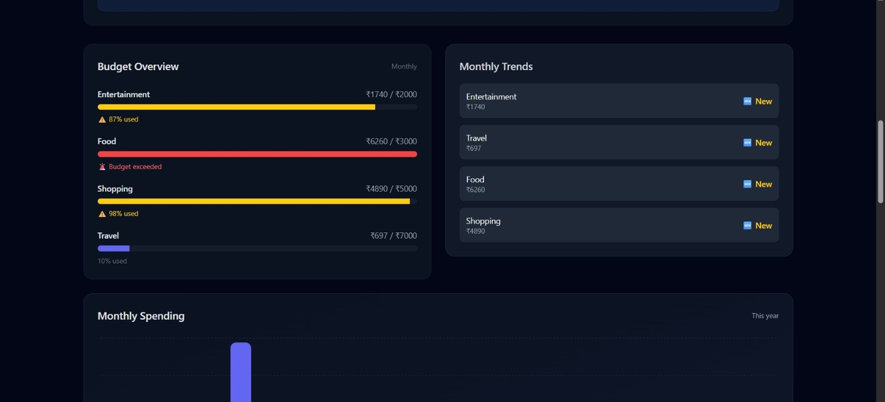
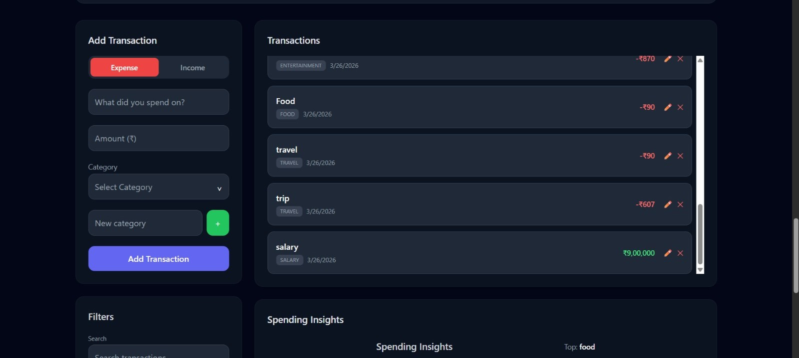
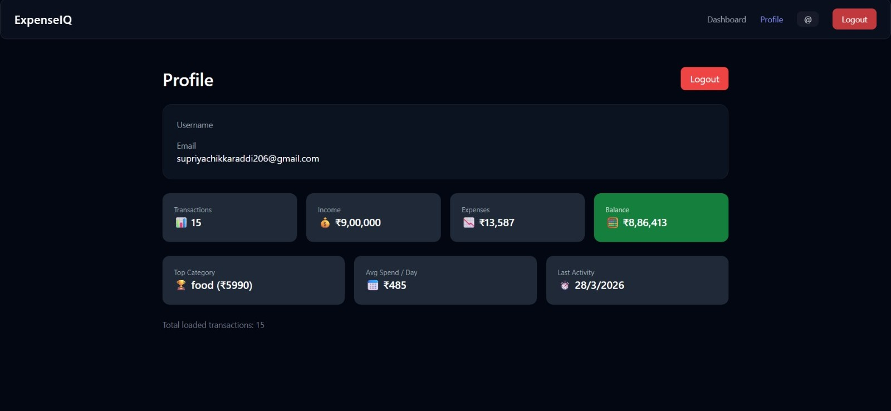

# 💰 ExpenseIQ – Personal Finance Analytics Dashboard

🚀 **Live Demo:** https://expense-tracker-five-wheat-97.vercel.app/  
📂 **GitHub:** https://github.com/SupriyaChikkaraddi21/expense-tracker  


# 🧠 Project Overview

ExpenseIQ is a full-stack personal finance analytics dashboard designed to go beyond basic expense tracking.

Most expense trackers only record transactions. ExpenseIQ focuses on:
- Analyzing spending behavior  
- Detecting overspending early  
- Providing actionable financial insights  

It transforms raw financial data into **clear, decision-ready insights**.

> Not just “Where did your money go?”  
> 👉 **“What should you do next?”**


# 🔥 Key Value Proposition

- Converts financial data into actionable insights  
- Enables budget control with predictive warnings  
- Identifies spending patterns and financial risks  
- Provides daily optimization suggestions  
- Designed like a real-world fintech product  


# 📸 Screenshots

# 🏠 Dashboard


# 📊 Spending Insights (Pie Chart)


# 🧠 Smart Insights Engine


# 📊 Budget Overview & Monthly Trends


# 💳 Transactions Management


# 👤 Profile Analytics



# ✨ Features

# 🔹 Core Features
- Add, edit, delete transactions  
- Real-time income vs expense tracking  
- Dynamic balance calculation  
- Category-based expense tracking  
- Advanced filtering (search, category, month)  
- Visual analytics (pie chart insights)  
- Profile analytics:
  - Total transactions  
  - Avg spend/day  
  - Top category  
  - Last activity  


# 🔸 Advanced Features
- Smart insights engine:
  - Budget usage %  
  - Overspending alerts  
  - Daily spending suggestions  
- Category-based budgeting system  
- Budget prediction (early warning system)  
- Monthly spending trends visualization  
- Rule-based AI-inspired insights system  
- Clean dark UI with smooth UX  


# 🏗 System Design (High-Level)

Frontend (React + Vite) ↓ REST API (Node.js + Express) ↓ PostgreSQL Database

- JWT-based authentication  
- RESTful API architecture  
- Modular backend design  


# 🛠 Tech Stack

# Frontend
- React (Vite + TypeScript)  
- Tailwind CSS  

# Backend
- Node.js  
- Express  

# Database
- PostgreSQL  

# Deployment
- Vercel (Frontend)  
- Render (Backend + Database)  


# ⚙️ Installation & Setup

# 1. Clone Repository
```bash
git clone https://github.com/your-username/expense-tracker.git
cd expense-tracker


2. Backend Setup

cd backend
npm install

Create .env file:
Environment
DATABASE_URL=your_postgres_url
JWT_SECRET=your_secret

Run backend:
npm run dev

3. Frontend Setup

cd frontend
npm install

Create .env file:
Environment
VITE_API_URL=http://localhost:5000

Run frontend:
npm run dev

🔐 Environment Variables
Environment
# Frontend
VITE_API_URL=

# Backend
DATABASE_URL=
JWT_SECRET=

# 📊 What Makes This Project Strong

- Moves beyond CRUD by focusing on analytics and decision-making  
- Implements budgeting with predictive logic (early overspending detection)  
- Generates real-time, actionable financial insights  
- Integrates frontend, backend, and data processing seamlessly  
- Demonstrates product-oriented thinking, not just feature implementation  


# 📈 Future Improvements

- Integration of real AI/ML-based insights  
- Advanced spending prediction models  
- Notification system (email/push alerts)  
- Enhanced mobile responsiveness  
- Month-over-month financial comparison analytics  


# 👨‍💻 Author

**Supriya Chikkaraddi**  
🔗 https://github.com/SupriyaChikkaraddi21  


# ⚠️ Disclaimer

This project uses a rule-based analytics engine to simulate intelligent insights.  
It is designed to demonstrate system design, financial logic, and full-stack engineering rather than reliance on external AI APIs.
